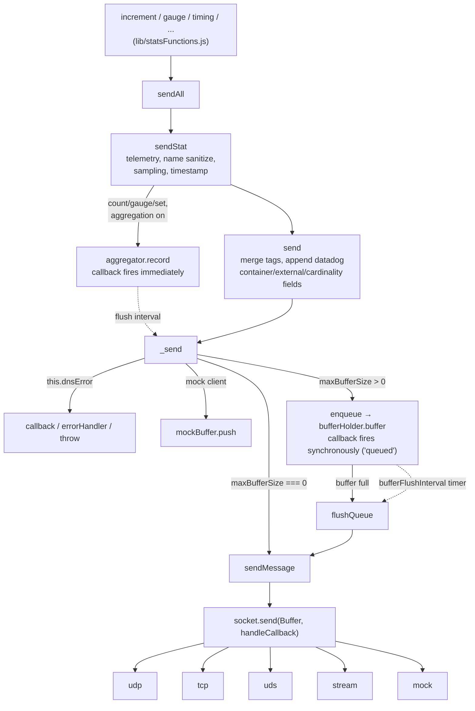
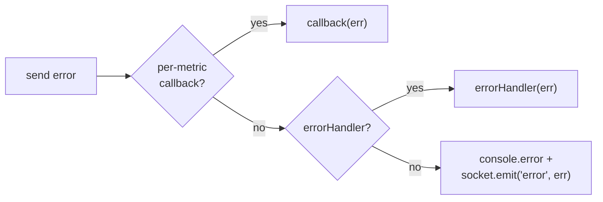
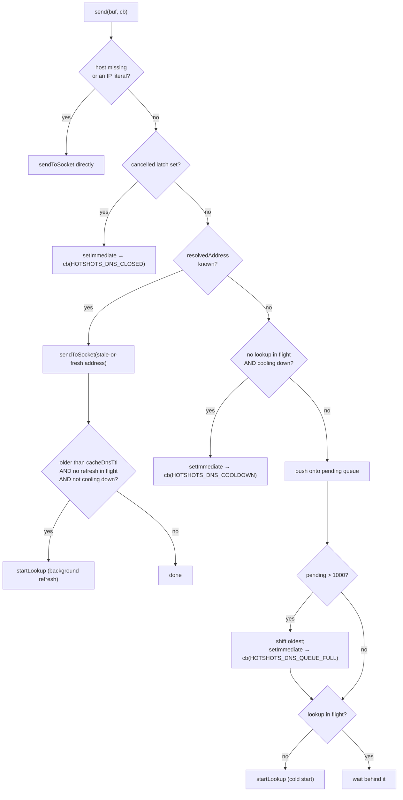
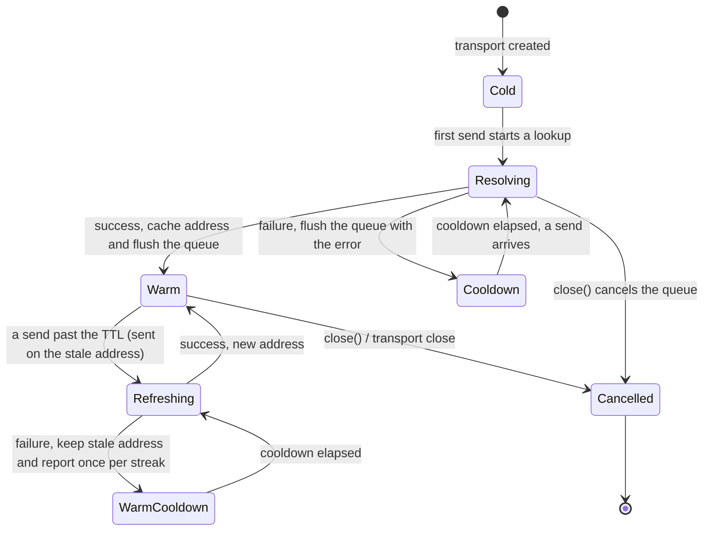
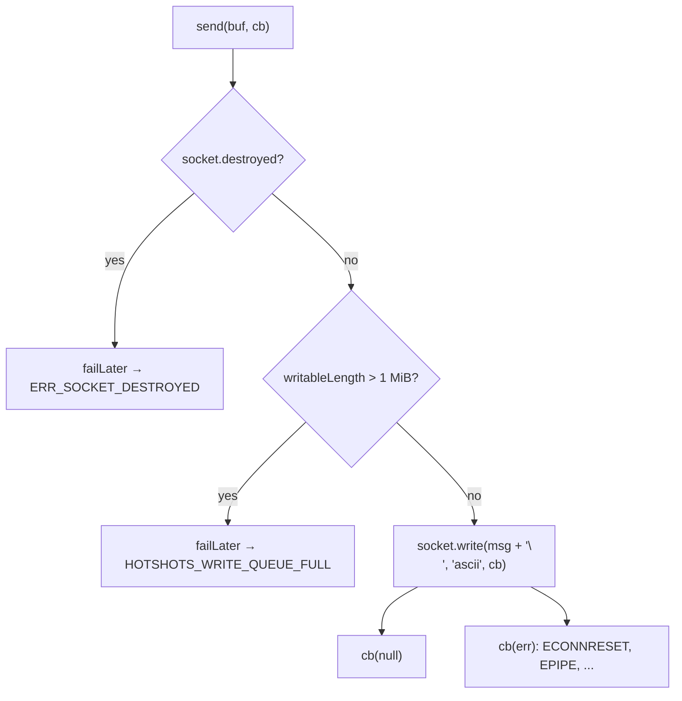
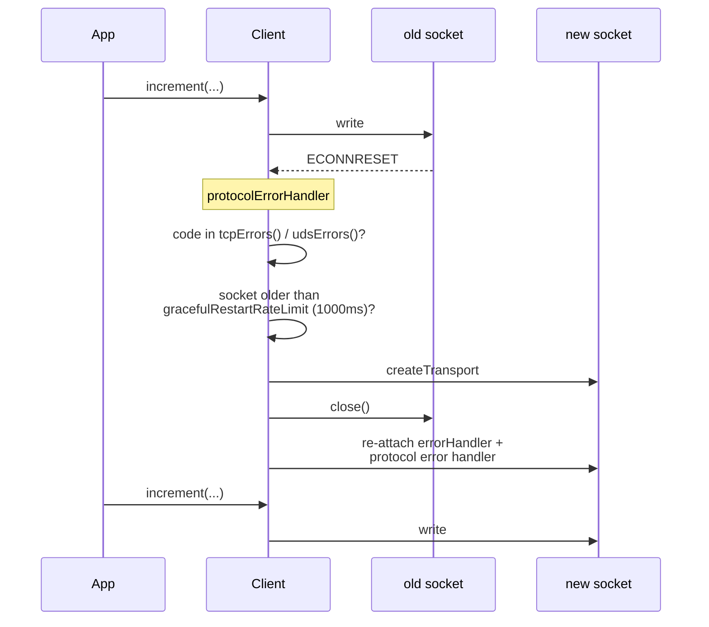
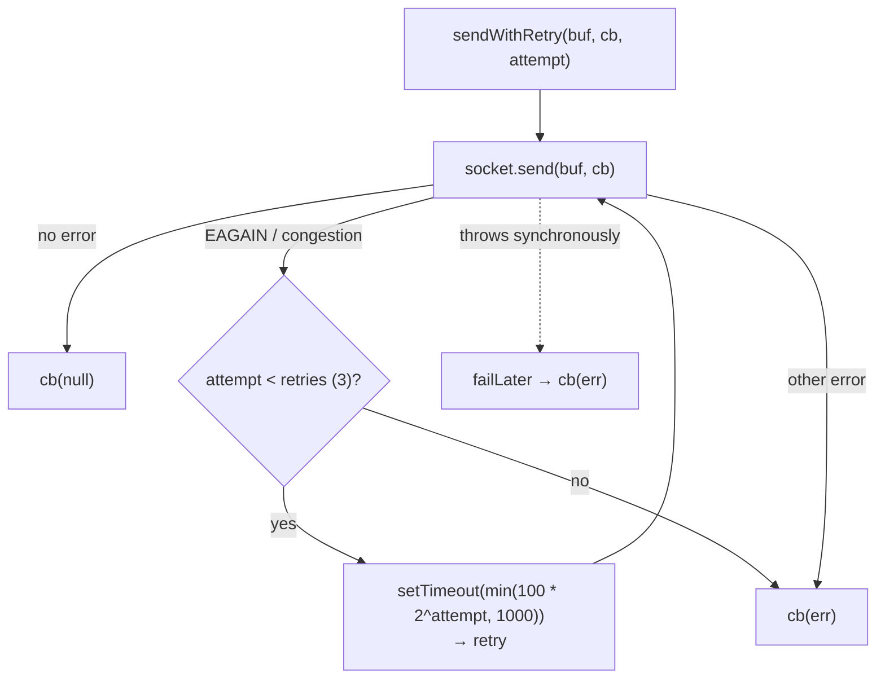
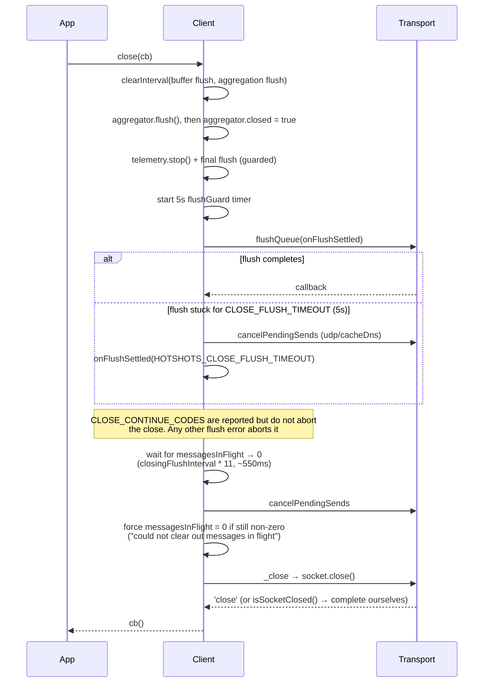

# Networking in hot-shots

Connections and DNS in hot-shots are difficult to follow and have many failure modes.
This document covers how a metric leaves the process, and how that can fail, for each
of the five transports (udp, tcp, uds, stream, mock).

- [The shared pipeline](#the-shared-pipeline)
- [Invariants](#invariants)
- [UDP](#udp)
- [TCP](#tcp)
- [UDS](#uds)
- [Stream and mock](#stream-and-mock)
- [Transport comparison](#transport-comparison)
- [Closing](#closing)
- [Error code reference](#error-code-reference)

## The shared pipeline

Everything above sendMessage in the diagram below is protocol-independent. Below it, this.socket is
not a Node socket but the transport object lib/transport.js builds. That object holds send, close,
the EventEmitter passthroughs, and a few protocol-specific hooks the caller feature-checks. It is
where the protocol differences live.

sendMessage is where every send converges. It recreates a missing socket (tcp/uds only)
and lets UDP refuse a send while DNS is unusable. It also tracks messagesInFlight so
close() can drain, records telemetry bytes, triggers TCP/UDS socket replacement, and
routes errors:

## Invariants

These hold for every transport and explain most of the non-obvious code.

| Invariant | Why |
|---|---|
| A send failure never calls back on the send's own stack frame (failLater / setImmediate) | The documented errorHandler pattern is "emit a metric when a send fails". An inline callback would recurse into the same failing path until RangeError |
| Every queued send is called back exactly once | The drain in close() waits on messagesInFlight, and a swallowed callback hangs it |
| A user callback that throws never escapes a fan-out (invokeCallback) | Batch flushes would otherwise abandon the rest of the batch, or the close itself |
| In-memory queueing is capped in every transport | Each transport can otherwise accumulate without bound when its peer is gone |
| Every socket-backed transport attaches a default 'error' listener | An EventEmitter emitting 'error' with no listener crashes the process |
| Telemetry splits drops by cause | REFUSED_CODES, meaning a client-side capacity or lifecycle refusal, count as bytes_dropped_queue / packets_dropped_queue. Every other resolve or write failure counts as the _writer pair |

The caps:

| Transport | What accumulates | Cap | Code on drop |
|---|---|---|---|
| udp (cacheDns) | sends waiting on an in-flight lookup | DNS_MAX_PENDING = 1000, oldest dropped | HOTSHOTS_DNS_QUEUE_FULL |
| tcp | socket.writableLength while connecting / peer not reading | MAX_PENDING_WRITE_BYTES = 1 MiB | HOTSHOTS_WRITE_QUEUE_FULL |
| stream | stream.writableLength while the consumer is stalled | MAX_PENDING_WRITE_BYTES = 1 MiB | HOTSHOTS_WRITE_QUEUE_FULL |
| uds | sends waiting out an EAGAIN/congestion retry backoff | UDS_MAX_PENDING_RETRIES = 1000, oldest dropped | HOTSHOTS_UDS_RETRY_QUEUE_FULL |

## UDP

The default. Connectionless, so "sent" means "handed to the kernel".

Two construction details. An IP-literal host picks the socket type: ::1 gives udp6,
127.0.0.1 gives udp4. Everything else, a hostname included, gets udp4. hot-shots then
pins lookups to family 4. A resolver that answers localhost with ::1 on Node 17+
therefore cannot hand the socket an address it will refuse. Separately, a custom lookup
short-circuits IP literals so APM tools do not see a DNS span per packet.

Without cacheDns, a hostname means a dns.lookup for every packet. With cacheDns
(cacheDnsTtl 60000 ms), a state machine sits in front of the socket:

Behaviors:

- **Failure cooldown ramps.** DNS_COOLDOWN_BASE_MS (1 s), doubling per consecutive
  failure, capped at cacheDnsTtl. Success resets it. Without a cooldown a fast-failing
  resolver degrades back into one lookup per send. It ramps rather than sitting at a flat
  TTL for the cold start. A process that starts before its resolver is ready then loses
  about a second of metrics rather than 60 s.
- **hot-shots pins lookups to the socket's address family**, or getaddrinfo can hand a
  udp4 socket a ::1 that fails every send with EINVAL.
- **A stale address keeps working while a refresh runs.** A background refresh has no send
  callback to carry an error. hot-shots emits the failure on the socket instead, once per
  contiguous failure streak, and logs it only if no user 'error' listener exists.
- **The cancelled latch is permanent.** After close(), later sends fail rather than
  re-queueing into a queue nothing will flush again.
- **A background refresh cannot be cancelled.** getaddrinfo is neither unref-able nor
  abortable, so a refresh started just before close() delays process exit.

UDP-only transport hooks, all feature-checked by callers: getDnsPendingCount(),
isDnsSendBlocked(), cancelPendingSends(error).

## TCP

A single persistent, keep-alive, unref'd net connection. Messages are newline-terminated
and written as ascii.

With no `host`, the connection targets `127.0.0.1` rather than letting Node fall back to
`localhost`. That skips a DNS lookup on the loopback path, matching what dgram already
does for UDP. It also avoids resolving to `::1` first and missing an agent bound to IPv4
only. Reach an IPv6 agent by passing `host: '::1'`. When `host` is an explicit hostname,
the connect tries every resolved address family rather than only the first. Node 20+ does
that by default. hot-shots sets `autoSelectFamily` explicitly, so the behavior still holds
when the default is disabled, such as under `--no-network-family-autoselection`.

The backpressure guard exists because Node queues writes without bound while a socket is
connecting or its peer has stopped reading. A healthy peer never approaches it.

### Graceful restart

TCP and UDS get a socket-replacement path no other transport has, on by default via
tcpGracefulErrorHandling / udsGracefulErrorHandling.

At most one replacement per second. If the new transport cannot be created, the old socket
is left intact and the error is reported.

Two paths reach protocolErrorHandler, and they differ on child clients:

| Path | Runs for children? |
|---|---|
| The socket's own 'error' listener, installed by maybeAddProtocolErrorHandler | No. A child shares a socket it did not create, so it never installs one |
| The send callback in sendMessage, for any tcp/uds client with a callback or an errorHandler | Yes. A child that replaces the socket updates only its own this.socket, leaving the parent pointed at the old one |

Separately, a missing this.socket is recreated inline by sendMessage, again for tcp and
uds only.

## UDS

Unix domain datagrams, through the optional unix-dgram dependency. The default path is
/var/run/datadog/dsd.socket. A construction failure leaves this.socket === null and
reports through errorHandler or console.error.

**Buffering is on by default.** maxBufferSize defaults to 8192 (Datadog's
recommendation) and is hard-capped there. A per-metric callback is therefore a *queued*
signal, not a delivery signal. And **sends retry with backoff**, because EAGAIN
and unix-dgram's congestion sentinel mean a full receiver buffer, which is recoverable:

udsRetryOptions defaults: retries 3, retryDelayMs 100, maxRetryDelayMs 1000,
backoffFactor 2. The backoff is real wall-clock time during which the send stays counted
in messagesInFlight. A retry still waiting out its backoff when close() runs is abandoned
with HOTSHOTS_UDS_RETRY_CANCELLED rather than fired at a closing socket.

Those pending retries are capped at UDS_MAX_PENDING_RETRIES. Each one holds its buffer
and a timer for up to retries * maxRetryDelayMs, so a receiver stalled on EAGAIN would
otherwise retain every flush that arrived during the stall. retries caps attempts per
send, not the number of sends retrying at once. Past the cap the oldest pending retry is
dropped with HOTSHOTS_UDS_RETRY_QUEUE_FULL.

Retrying and replacing are separate mechanisms with separate triggers. The retry above
fires on EAGAIN and the congestion sentinel. Socket replacement fires on
constants.udsErrors(), which is platform-specific and includes *negative numeric* errnos,
since unix-dgram sets err.code to a raw errno.

close() synthesizes the 'close' event unix-dgram never emits, and unref() throws. A UDS
client does hold the process open.

## Stream and mock

**Stream** is a caller-supplied writable: newline-terminated like TCP, same destroyed-check
and 1 MiB guard. The differences are all about ownership. The stream belongs to the
application, which gives it three properties no other transport has:

- The default 'error' listener is removable, and is re-attached if destroy() throws.
- Client._close completes an already-destroyed stream itself. It does not re-emit
  'close' into the application's own listeners.
- unref() throws.

**Mock** builds no socket at all, just a plain object with its own listener map. _send
routes into mockBuffer before reaching sendMessage, so the mock transport's send is not the
path metrics take. It exists so socket lifecycle, listeners, and close() behave the way a
real transport would.

## Transport comparison

| | udp | tcp | uds | stream | mock |
|---|---|---|---|---|---|
| Connection | none | persistent | connected datagram | caller's stream | none |
| Newline-terminated | no | yes | no | yes | n/a |
| Default maxBufferSize | 0 | 0 | 8192 (hard cap) | 0 | 0 |
| DNS | per-packet, or cached with cacheDns | at connect only, and none at all without a host | n/a | n/a | n/a |
| Backpressure guard | cacheDns lookup queue (1000) | 1 MiB unflushed | retry/backoff | 1 MiB unflushed | none |
| Retries | none | none | EAGAIN / congestion, tuned by udsRetryOptions | none | none |
| Socket auto-replacement | no | yes | yes | no | no |
| Recreated by sendMessage if missing | no | yes | yes | no | no |
| unref() | works | works | throws | throws | no-op |
| Emits 'close' on close | yes | yes | synthesized | yes (unless already destroyed) | synthesized |
| Delivery guarantee | none | TCP-level only | none | stream-dependent | n/a |

## Closing

close() reconciles a buffered payload, in-flight sends, a possibly stuck transport, and a
DNS queue, and it must always call the caller's callback.

- The **5 s flush guard** covers the two ways a transport can never call back: a cold-start
  DNS lookup, and a write behind a connect that never completes. It is much larger than the
  drain budget on purpose, since a first DNS lookup or TCP connect taking a few hundred ms
  is ordinary.
- **A flush error outside CLOSE_CONTINUE_CODES aborts the close.** _close() never runs and
  the socket stays open, so a caller must not assume a closed socket on error.
- **DNS cancellation runs at finish()**, so sends whose lookup resolves within the budget
  are preserved and their callbacks cannot drive messagesInFlight negative afterwards. The
  flush guard is the one exception: it cancels early, because the flush is already stuck.
- **isSocketClosed()** (tcp, stream) is checked first, since destroy() only emits 'close'
  once and _close would wait forever on an already-destroyed socket.
- **_close is always reached via setImmediate.** unix-dgram crashes if close() runs inside
  a send completion callback on the same tick.
- The drain waits on **this client plus every client the aggregator routed a send
  through**, which can be a child. Nothing else about a child is visible here. Each client
  counts its own messagesInFlight, and a child's unaggregated in-flight sends do not hold
  up the parent's close.

## Error code reference

| Code | Transport | Meaning | Telemetry bucket |
|---|---|---|---|
| HOTSHOTS_DNS_QUEUE_FULL | udp (cacheDns) | 1000 sends already queued behind a lookup; oldest dropped | queue |
| HOTSHOTS_DNS_COOLDOWN | udp (cacheDns) | a recent lookup failed and the next attempt is not due yet | queue |
| HOTSHOTS_DNS_CANCELLED | udp (cacheDns) | queued mid-lookup, cancelled by close() | queue |
| HOTSHOTS_DNS_CLOSED | udp (cacheDns) | send arrived after close() latched the queue shut | queue |
| HOTSHOTS_UDS_RETRY_CANCELLED | uds | a retry was waiting out its backoff when close() ran | queue |
| HOTSHOTS_UDS_RETRY_QUEUE_FULL | uds | 1000 sends already waiting out a retry backoff; oldest dropped | queue |
| HOTSHOTS_WRITE_QUEUE_FULL | tcp, stream | 1 MiB already unflushed in the socket | queue |
| HOTSHOTS_CLOSE_FLUSH_TIMEOUT | any | close() stopped waiting on the final flush | n/a |
| ERR_SOCKET_DESTROYED | tcp | write attempted on a destroyed socket | writer |
| ERR_STREAM_DESTROYED | stream | write attempted on a destroyed stream | writer |
| EAGAIN / congestion | uds | receiver buffer full; retried before surfacing | writer |

The seven queue-bucket codes are REFUSED_CODES: the client turned the send away, or, for the
abandoned uds retry, stopped retrying it. Everything else falls into the writer bucket,
including a DNS lookup that failed before any packet was written. CLOSE_CONTINUE_CODES
adds the flush timeout, giving the set of errors that must not abort close().
