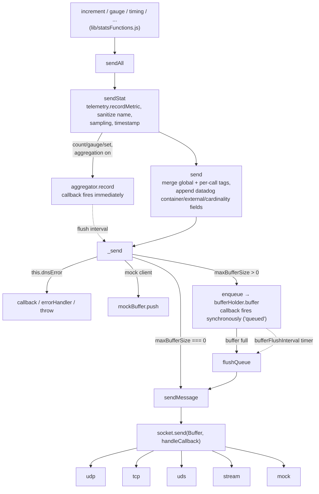
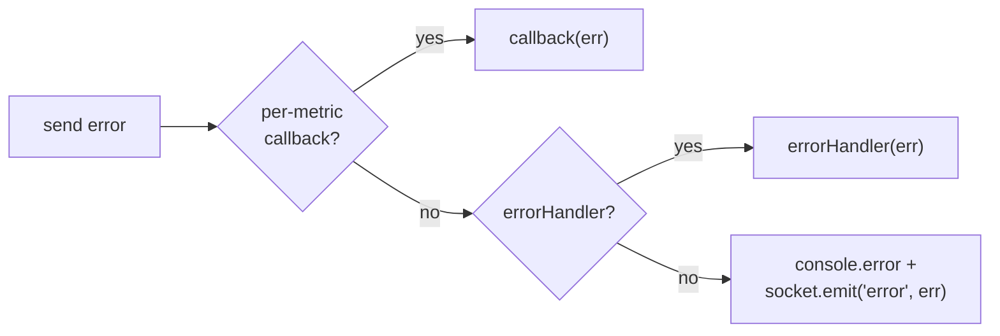
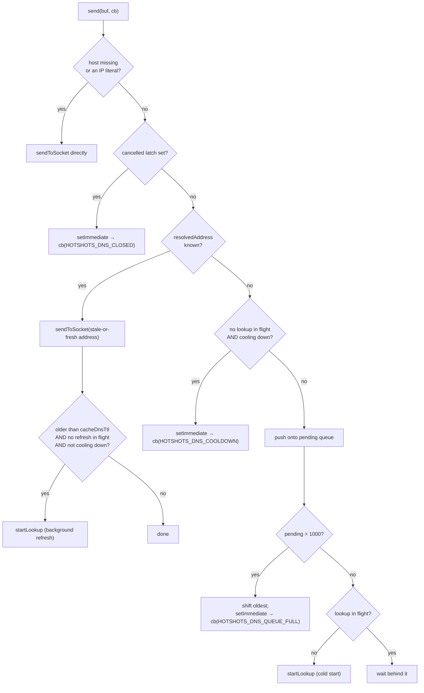
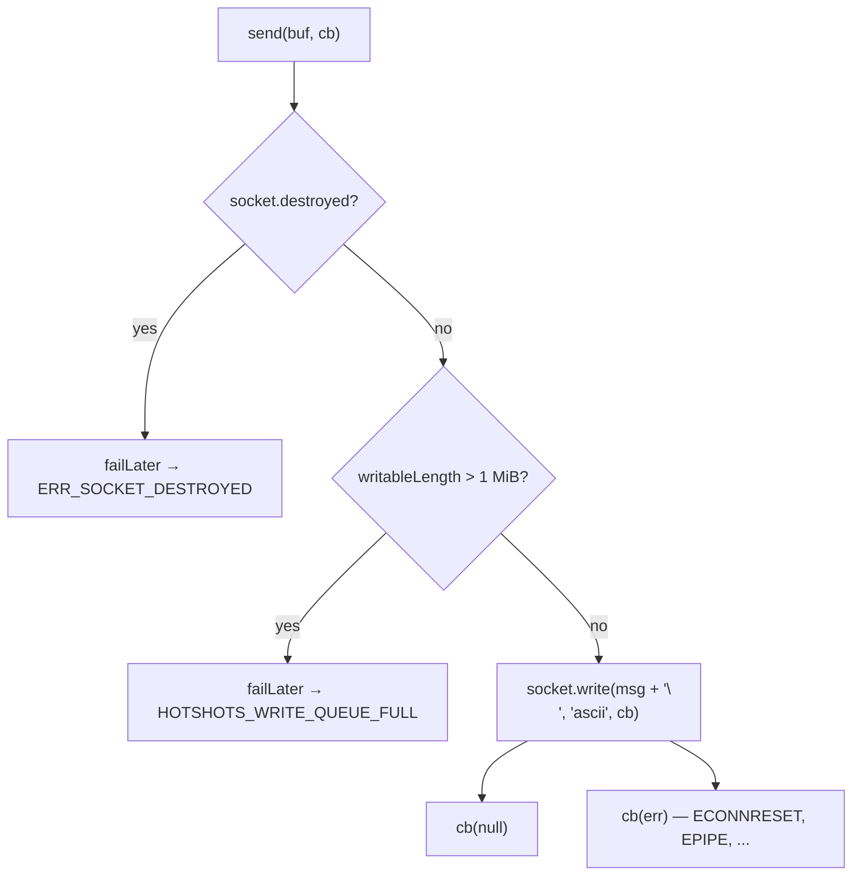
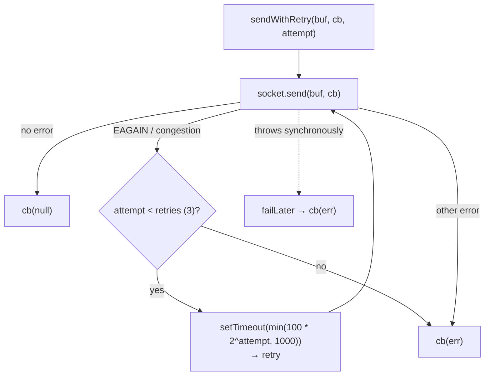
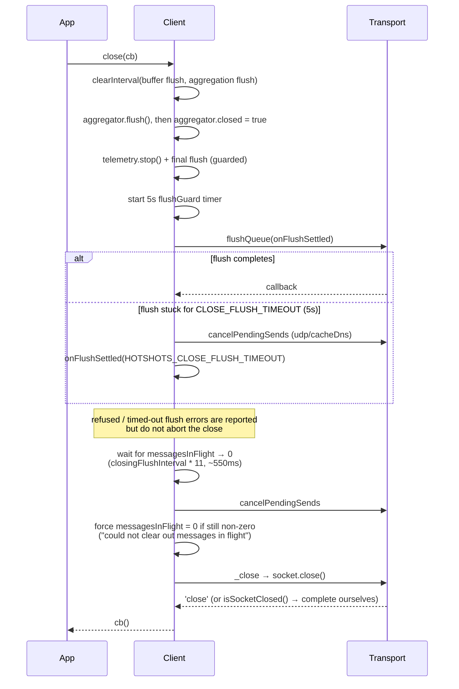

# Networking in hot-shots

How a metric actually leaves the process, and every way that can fail, for each of
the five transports (`udp`, `tcp`, `uds`, `stream`, `mock`).

- [The shared pipeline](#the-shared-pipeline)
- [Rules that hold for every transport](#rules-that-hold-for-every-transport)
- [UDP](#udp)
- [TCP](#tcp)
- [UDS](#uds)
- [Stream](#stream)
- [Mock](#mock)
- [Transport comparison](#transport-comparison)
- [Closing](#closing)
- [Error code reference](#error-code-reference)

## The shared pipeline

Everything above `Client.prototype.sendMessage` is protocol-independent. All of the
protocol differences live in `socket.send()`, which is the transport object built by
`lib/transport.js`.

`sendMessage` is the choke point worth knowing well (`lib/statsd.js:579`). In order it:

1. Returns immediately for an empty message or a mock client.
2. Recreates a missing socket, but only for `tcp` and `uds` — those are the protocols
   whose sockets get torn down and replaced by `protocolErrorHandler`. A missing UDP
   or stream socket is a permanent construction failure and reports
   `Socket not created properly`.
3. Asks the transport `isDnsSendBlocked()` — a UDP/`cacheDns`-only hook — and rejects
   the send *before* incrementing the in-flight counter.
4. Allocates a drain promise on the 0 → 1 transition of `messagesInFlight`, increments,
   then calls `socket.send`.
5. In `handleCallback`, decrements (clamped at zero), resolves the drain promise on
   1 → 0, records telemetry bytes, runs TCP/UDS socket replacement if the error warrants
   it, and routes the error.

Error routing precedence inside `handleCallback` is the same everywhere:

## Rules that hold for every transport

These are invariants the transports are written to preserve; they explain most of the
non-obvious code in `lib/transport.js`.

**A send failure never calls back on the send's own stack frame.** The documented
`errorHandler` pattern is "emit a metric when a send fails". If a synchronous failure
path called back inline, that resend would re-enter the same always-fails path and grow
the stack until the process throws `RangeError`. Real I/O errors arrive from the event
loop and already satisfy this; the synchronous paths (destroyed socket, refused write,
`dgram`/`unix-dgram` throwing, `dns.lookup` throwing, a queue-full drop) go through
`failLater` or an explicit `setImmediate`. `failLater` batches every deferral in a tick
into one `setImmediate`, and builds each `Error` lazily from a factory, because a burst
against a stalled transport can refuse hundreds of thousands of sends in a single tick.
It also swaps the queue out before draining, so a callback that resends and fails again
lands in a *fresh* queue on the *next* tick rather than extending the current drain.

**Every queued send is called back exactly once.** The client's drain logic during
`close()` depends on it: a swallowed callback leaves `messagesInFlight` permanently
non-zero.

**Unbounded in-memory queueing is capped.** Each transport has a way to accumulate
memory when its peer is gone, and each has a cap:

| Transport | What accumulates | Cap | Code on drop |
|---|---|---|---|
| udp (`cacheDns`) | sends waiting on an in-flight lookup | `DNS_MAX_PENDING` = 1000, oldest dropped | `HOTSHOTS_DNS_QUEUE_FULL` |
| tcp | `socket.writableLength` while connecting / peer not reading | `MAX_PENDING_WRITE_BYTES` = 1 MiB | `HOTSHOTS_WRITE_QUEUE_FULL` |
| stream | `stream.writableLength` while the consumer is stalled | `MAX_PENDING_WRITE_BYTES` = 1 MiB | `HOTSHOTS_WRITE_QUEUE_FULL` |
| uds | nothing queues; `EAGAIN`/congestion is retried with backoff | `retries` = 3 by default | the underlying error |

**Telemetry byte accounting splits by cause.** A client-side refusal (any code in
`REFUSED_CODES`) is counted as a *queue* drop; anything that actually tried to resolve or
write is counted as a *writer* error. See `handleCallback` in `lib/statsd.js:657`.

**Every transport attaches a default `error` listener.** An `EventEmitter` that emits
`'error'` with no listener crashes the process, and `sendMessage`'s legacy
`socket.emit('error', ...)` fallback would do exactly that on a bare socket or a
user-supplied stream. The default listener only writes to `debug()`; the UDP transport
additionally distinguishes it from a user listener so it knows whether a DNS refresh
failure would otherwise go unseen.

## UDP

The default. Connectionless, so "sent" means "handed to the kernel" — there is no
delivery guarantee and no peer-side backpressure.

Socket construction (`lib/transport.js:194`) does two things worth knowing:

- **Socket type auto-detection.** If `host` is an IP literal, the socket becomes `udp6`
  or `udp4` to match it. Otherwise `udp4`. This is why `localhost` resolving to `::1` on
  Node 17+ does not silently break sends.
- **An IP-bypass `lookup`.** Node calls the socket's `lookup` before *every* packet. For
  an IP literal `dns.lookup` short-circuits without hitting a resolver, but it still
  creates an instrumented async operation that APM tools report as a span per packet. The
  installed `lookup` short-circuits IP literals itself and delegates hostnames to
  `dns.lookup`. It is installed even when `host` is a hostname, because Node also routes
  the default address and any `cacheDns`-resolved address through it.

### Without `cacheDns` (the default)

`socket.send(buf, 0, len, port, host, cb)` per message. If `host` is a hostname, Node
performs a `dns.lookup` **for every packet**. `dgram` throws synchronously once the
socket is closed, which is caught and deferred via `failLater`.

### With `cacheDns`

A small state machine sits in front of the socket. `cacheDnsTtl` defaults to 60000 ms.

The lookup itself:

Three behaviours in there are deliberate and easy to misread:

**Failures earn a full `cacheDnsTtl` of cooldown.** Without it, a fast-failing resolver
(a cached NXDOMAIN, a SERVFAIL) degrades into one lookup per send — exactly the
per-packet behaviour the caching exists to eliminate. The cost is that recovery is
noticed up to one TTL late. During a cold-start cooldown there is no address to send to
and no lookup to wait behind, so the send is refused with `HOTSHOTS_DNS_COOLDOWN` rather
than queued for a flush nothing would trigger.

**A stale address keeps working while a refresh runs.** A send past the TTL goes out
immediately on the cached address and the refresh happens in the background. That refresh
has no send callback to carry an error, so a failure is emitted on the socket and — only
if no *user* `error` listener is attached — also written to `console.error`. It is
reported once per contiguous failure streak, so a flapping resolver does not log every
TTL.

**The `cancelled` latch is permanent.** Once `cancelPendingSends` runs (from `close()`),
every later send fails instead of re-queueing. Without the latch, a cancelled callback
that resends would put an entry back into `pending` that nothing would ever cancel or
flush again — and a lookup that resolves *after* cancellation would reopen the warm path
against a socket `_close()` may already have closed, whose synchronous throw is the very
recursion hazard the latch prevents. This is also why `startLookup`'s callback ignores a
result that arrives post-cancellation.

The queue-overflow path pushes first and trims afterwards, invoking the dropped entries'
callbacks only once the queue is back at the cap and only on a later tick. Shift-then-push
would let a synchronously resending drop callback see room, not drop, and then have the
outer push land on top — growing the queue by one per send.

UDP-only transport hooks, all of which callers must feature-check: `getDnsPendingCount()`
(test hook), `isDnsSendBlocked()` (used by `sendMessage`), `cancelPendingSends(error)`
(used by `close()`).

## TCP

A single persistent `net` connection with keep-alive, `unref`'d so it does not hold the
process open. Messages are newline-terminated (`addEol`) and written as `ascii`.

The backpressure check exists because Node queues writes without bound while a socket is
still connecting or its peer has stopped reading — an unreachable host would otherwise
turn every metric into retained memory. A healthy peer keeps `writableLength` near zero,
so normal operation never approaches the limit.

### Graceful restart

TCP (and UDS) get a socket-replacement path that no other transport has, enabled by
default via `tcpGracefulErrorHandling`.

It is reached two ways: from the socket's own `'error'` listener installed by
`maybeAddProtocolErrorHandler`, and from `handleCallback` when a per-metric `callback` or
an `errorHandler` is present (in that case the error goes to the callback rather than
being emitted on the socket, so the listener would never see it). The retryable codes are
in `constants.tcpErrors()`. The rate limit means at most one replacement per second; if
the new transport cannot be created the old socket is left intact and an error is
reported. Child clients never do this — they share a socket they did not create.

Separately, if `this.socket` is missing entirely when `sendMessage` runs, TCP and UDS
attempt a fresh `trySetNewSocket` inline.

## UDS

Unix domain datagrams via the optional `unix-dgram` dependency. Construction throws a
descriptive error if the module is not installed, and `socket.connect(path)` failing
closes the socket and rethrows — either way `createTransport`'s outer `catch` routes it
to `errorHandler` or `console.error` and the client is left with `this.socket === null`.
Default path is `/var/run/datadog/dsd.socket`.

Two things are unique to UDS:

**Buffering is on by default.** `maxBufferSize` defaults to 8192 for UDS (Datadog's
recommendation) versus 0 elsewhere, and a larger configured value is clamped to 8192 with
a warning. So by default UDS metrics take the `enqueue` path and the per-metric callback
is a *queued* signal, not a delivery signal.

**Sends retry with exponential backoff.** `EAGAIN` and `unix-dgram`'s internal
`congestion` sentinel (which some builds expose as `errno === 1`) mean the receiver's
buffer is full — a recoverable condition, unlike a TCP reset.

Defaults come from `udsRetryOptions`: `retries` 3, `retryDelayMs` 100, `maxRetryDelayMs`
1000, `backoffFactor` 2. Note that the retry delay is real wall-clock time in which the
send stays counted in `messagesInFlight`.

UDS also gets the graceful-restart path described under TCP, with its own
`udsGracefulErrorHandling` / `udsGracefulRestartRateLimit` and the codes in
`constants.udsErrors()` — which are platform-specific and include *negative numeric*
errnos, because `unix-dgram` sets `err.code` to a raw errno rather than a string name.

`close()` is synchronous and emits a synthetic `'close'`, since `unix-dgram` does not.
`unref()` throws — `unix-dgram` has no such capability, so a UDS client *does* hold the
process open.

## Stream

A caller-supplied writable stream. Newline-terminated like TCP, and with the same
destroyed-check and 1 MiB backpressure guard. The differences are all about ownership:
the stream belongs to the application, not to hot-shots.

- The default `error` listener is a *named* function so `close()` can remove it, and it
  is re-attached if `stream.destroy()` throws synchronously (the stream survived, so it
  still needs crash protection).
- `isSocketClosed()` reports an already-destroyed stream rather than synthesizing a
  `'close'` event — a second `'close'` would run the application's own listeners again.
  `Client._close` completes the close itself in that case.
- `unref()` throws; there is nothing to unref.

## Mock

`mock: true` builds no socket at all. The transport is a plain object with its own
listener map; `send` calls back immediately with `(null, buf.length)`, and `close` emits
`'close'` on a `setImmediate` to mimic a real socket. Note that `_send` short-circuits
into `mockBuffer` before ever reaching `sendMessage`, so in normal use the mock
transport's `send` is not the path metrics take — the mock transport exists so that the
socket lifecycle, listeners, and `close()` behave realistically.

## Transport comparison

| | udp | tcp | uds | stream | mock |
|---|---|---|---|---|---|
| Connection | none | persistent | connected datagram | caller's stream | none |
| Newline-terminated | no | yes | no | yes | n/a |
| Default `maxBufferSize` | 0 | 0 | 8192 (hard cap) | 0 | 0 |
| DNS | per-packet, or cached with `cacheDns` | at connect only | n/a | n/a | n/a |
| Backpressure guard | pending-lookup queue (1000) | 1 MiB unflushed | retry/backoff | 1 MiB unflushed | none |
| Retries | none | none | EAGAIN / congestion | none | none |
| Socket auto-replacement | no | yes | yes | no | no |
| Recreated by `sendMessage` if missing | no | yes | yes | no | no |
| `unref()` | works | works | throws | throws | no-op |
| Emits `'close'` on close | yes | yes | synthesized | yes (unless already destroyed) | synthesized |
| Delivery guarantee | none | TCP-level only | none | stream-dependent | n/a |

## Closing

`close()` has to reconcile a buffered payload, in-flight sends, a possibly stuck
transport, and a DNS queue — and it must always end up calling the caller's callback.

Points that matter per transport:

- The **5 s flush guard** exists because every transport has a way to never call back: a
  cold-start DNS lookup that never resolves, or a TCP/stream write sitting in a socket
  whose connect never completes. It is much larger than the drain budget on purpose — a
  first-ever DNS lookup or a TCP connect taking a few hundred milliseconds is ordinary and
  must not lose the flush.
- **DNS cancellation runs at `finish()`**, not before the drain wait, so every send whose
  lookup resolves within the budget is preserved. Doing it later, in `transport.close()`,
  would fire those callbacks after `messagesInFlight` had been forced to zero and drive it
  negative.
- **`isSocketClosed()`** (tcp, stream) is checked *before* closing: `destroy()` only emits
  `'close'` on the first call, so a socket the application already destroyed would leave
  `_close` waiting on an event that never arrives.
- **`_close` is always reached via `setImmediate`**, because `unix-dgram` crashes if
  `close()` is called from inside a send completion callback on the same tick.
- The drain covers **child clients too** — any client with an in-flight aggregator-routed
  send is collected, since children track their own `messagesInFlight` but share the
  parent's socket.

## Error code reference

| Code | Transport | Meaning | Telemetry bucket |
|---|---|---|---|
| `HOTSHOTS_DNS_QUEUE_FULL` | udp (`cacheDns`) | 1000 sends already queued behind a lookup; oldest dropped | queue |
| `HOTSHOTS_DNS_COOLDOWN` | udp (`cacheDns`) | a recent lookup failed and the next attempt is not due yet | queue |
| `HOTSHOTS_DNS_CANCELLED` | udp (`cacheDns`) | queued mid-lookup, cancelled by `close()` | queue |
| `HOTSHOTS_DNS_CLOSED` | udp (`cacheDns`) | send arrived after `close()` latched the queue shut | queue |
| `HOTSHOTS_WRITE_QUEUE_FULL` | tcp, stream | 1 MiB already unflushed in the socket | queue |
| `HOTSHOTS_CLOSE_FLUSH_TIMEOUT` | any | `close()` gave up waiting on the final flush | n/a |
| `ERR_SOCKET_DESTROYED` | tcp | write attempted on a destroyed socket | writer |
| `ERR_STREAM_DESTROYED` | stream | write attempted on a destroyed stream | writer |
| `EAGAIN` / `congestion` | uds | receiver buffer full; retried before surfacing | writer |

The first five are `REFUSED_CODES` — the client turned the send away and nothing reached
the socket. `CLOSE_CONTINUE_CODES` adds the flush timeout: errors that must not abort
`close()`.
